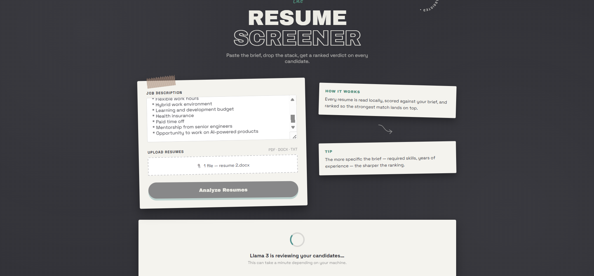

# 🗂️ Resume Screener

**An AI-powered resume screener that reads a job description and a stack of resumes, then ranks every candidate with a score, a verdict, and matched/missing skills — using a locally-hosted LLM, so no resume data ever leaves your machine.**

<p align="left">
  
  
  
  
  
  
</p>

---

## Table of Contents

- [About](#about)
- [Features](#features)
- [Tech Stack](#tech-stack)
- [Folder Structure](#folder-structure)
- [Installation](#installation)
- [Configuration](#configuration)
- [Usage](#usage)
- [Screenshots](#screenshots)
- [API Documentation](#api-documentation)
- [How the AI Scoring Works](#how-the-ai-scoring-works)
- [Performance Notes](#performance-notes)
- [Challenges Faced](#challenges-faced)
- [Future Improvements](#future-improvements)
- [Testing](#testing)
- [Deployment](#deployment)
- [Contributing](#contributing)
- [License](#license)
- [Acknowledgements](#acknowledgements)

---

## About

**Problem it solves:** Screening resumes by hand against a job description is slow, repetitive, and inconsistent — the same recruiter can rate the same resume differently on a Monday versus a Friday. This project automates the first pass: it reads every resume in a batch, compares it against the job description, and returns a ranked, explainable shortlist in the time it takes to make a coffee.

**Who it's for:** Recruiters and hiring managers who want a fast first-pass filter, students/developers building an ATS-style project for their portfolio, and anyone who wants resume screening that runs **entirely on their own machine** — no resume data is ever uploaded to a third-party API.

**Project type:** Full-Stack AI Web App
**Status:** 🚧 In Development

---

## Features

- 📋 **Paste-and-go job description input** — no rigid form fields, just paste the JD as-is
- 📎 **Multi-resume upload** with drag-and-drop, supporting PDF, DOCX, and TXT
- 🤖 **Local LLM scoring** via Ollama (Llama 3) — every resume is scored 0–100 against the JD
- 🏷️ **Verdict classification** — Strong / Moderate / Weak Match, generated by the model
- ✅ **Matched & missing skills extraction** for every candidate
- 🥇 **Automatic ranking** — results are sorted best-match-first
- 🛡️ **Per-file error isolation** — a corrupted or unreadable resume shows an "Error" card instead of crashing the whole batch
- 🖱️ **Drag-and-drop file intake** with live file-count feedback
- ⏳ **Loading and empty states** so the UI never looks broken while the model is thinking
- 🔒 **Privacy by design** — resumes are parsed, scored, and immediately deleted from disk; nothing is persisted or sent to the cloud

---

## Tech Stack

| Layer | Technology |
|---|---|
| **Frontend** | HTML5, Tailwind CSS (v4 via CDN), Vanilla JavaScript |
| **Backend** | Python, FastAPI, Uvicorn |
| **AI / LLM** | Ollama running Llama 3 (local inference) |
| **Resume Parsing** | `pdfplumber` (PDF), `python-docx` (DOCX), native read (TXT) |
| **HTTP Client** | `httpx` (backend → Ollama communication) |
| **File Uploads** | `python-multipart` |
| **Database** | None — the app is stateless by design |
| **Auth** | None currently (see [Future Improvements](#future-improvements)) |

> No React, no Node, no external LLM API keys — the entire pipeline runs on your machine with Python and Ollama.

---

## Folder Structure

```
resume-screener/
├── main.py              # FastAPI app: routes, upload handling, orchestration
├── ollama_client.py      # Talks to the local Ollama API, builds the scoring prompt
├── parser.py              # Extracts raw text from PDF / DOCX / TXT resumes
├── index.html             # Single-page frontend (UI, fetch logic, rendering)
├── requirements.txt       # Python dependencies
├── uploads/                # Temporary storage — files are deleted right after scoring
└── README.md
```

---

## Installation

### Prerequisites

- **Python 3.9+**
- **[Ollama](https://ollama.com)** installed and running locally
- The `llama3` model pulled in Ollama

### 1. Clone the repository

```bash
git clone https://github.com/<your-username>/resume-screener.git
cd resume-screener
```

### 2. Create a virtual environment

```bash
python -m venv venv

# Activate it
# Windows
venv\Scripts\activate
# macOS / Linux
source venv/bin/activate
```

### 3. Install dependencies

```bash
pip install -r requirements.txt
```

### 4. Start Ollama and pull the model

```bash
ollama serve
ollama pull llama3
```

Keep `ollama serve` running in its own terminal — the backend calls it on `localhost:11434`.

### 5. Run the backend

```bash
uvicorn main:app --reload
```

The backend serves the frontend directly — open **`http://localhost:8000`** in your browser and you're ready to screen resumes.

---

## Configuration

This project is fully local by default — there's no `.env` file or API key required to run it, since scoring happens through your local Ollama instance rather than a cloud LLM.

The only configurable values currently live at the top of `ollama_client.py`:

```python
OLLAMA_URL = "http://localhost:11434/api/generate"   # Ollama endpoint
MODEL = "llama3"                                       # Any model you've pulled in Ollama
```

If you want to point this at a different model (e.g. `llama3.1`, `mistral`) or a remote Ollama instance, edit these two constants. Moving them to environment variables is tracked in [Future Improvements](#future-improvements).

---

## Usage

1. Start Ollama (`ollama serve`) and the backend (`uvicorn main:app --reload`).
2. Open `http://localhost:8000` in your browser.
3. Paste the full job description into the **Job Description** field.
4. Drag and drop (or click to browse) one or more resumes — PDF, DOCX, or TXT.
5. Click **Analyze Resumes**.
6. Wait while the model reviews each file — this can take anywhere from a few seconds to a couple of minutes per resume depending on your machine.
7. Review the ranked results: each candidate shows a score out of 100, a verdict, a short summary, and their matched/missing skills.

---

## Screenshots

> Replace these placeholders with real screenshots once your UI is finalized.

**Landing Page**


**Loading State**


**Ranked Results**


**Single Candidate Card**


---

## API Documentation

### `GET /`

Serves the frontend (`index.html`).

---

### `POST /screen`

Screens one or more resumes against a job description.

**Request:** `multipart/form-data`

| Field | Type | Required | Description |
|---|---|---|---|
| `jd` | `string` | ✅ | The full job description text |
| `resumes` | `file[]` | ✅ | One or more resume files (`.pdf`, `.docx`, `.txt`) |

**Example (`curl`):**

```bash
curl -X POST http://localhost:8000/screen \
  -F "jd=We are hiring a backend engineer with FastAPI and PostgreSQL experience..." \
  -F "resumes=@candidate1.pdf" \
  -F "resumes=@candidate2.docx"
```

**Response:** `200 OK`

```json
{
  "results": [
    {
      "filename": "candidate1.pdf",
      "score": 82,
      "matched_skills": ["FastAPI", "PostgreSQL", "Docker"],
      "missing_skills": ["Kubernetes"],
      "summary": "Strong backend fundamentals with direct FastAPI experience. Lacks orchestration exposure.",
      "verdict": "Strong Match"
    },
    {
      "filename": "candidate2.docx",
      "score": 41,
      "matched_skills": ["Python"],
      "missing_skills": ["FastAPI", "PostgreSQL"],
      "summary": "General Python background but no evidence of backend framework experience.",
      "verdict": "Weak Match"
    }
  ]
}
```

**Status Codes:**

| Code | Meaning |
|---|---|
| `200` | Request succeeded — check each result's `verdict` for per-file outcomes |
| `422` | Missing `jd` or `resumes` in the request |
| `500` | Unexpected server error (rare — per-file errors are caught and returned as `"verdict": "Error"` instead) |

> Note: a resume that fails to parse or score does **not** fail the whole request — it comes back in `results` with `score: 0`, `verdict: "Error"`, and a `summary` explaining what went wrong.

---

## How the AI Scoring Works

This project doesn't train a model — it uses **Llama 3 for inference only**, run locally through Ollama.

- **Model:** Llama 3 (any Ollama-compatible model can be swapped in)
- **Input:** The job description plus the first ~3,000 characters of extracted resume text
- **Prompting:** A structured prompt instructs the model to act as an HR recruiter and return **only JSON** — no free text — containing a score, matched/missing skills, a short summary, and a verdict
- **Output parsing:** The backend extracts the JSON object from the model's response and validates it before returning it to the frontend
- **Evaluation:** There's no formal accuracy benchmark yet — scoring quality depends heavily on prompt phrasing and the underlying model. This is an active area for improvement (see below)

---

## Performance Notes

- Resumes in a single request are currently processed **sequentially**, not in parallel — a batch of 10 resumes takes roughly 10x as long as a single resume
- Inference time depends entirely on your local machine's CPU/GPU — expect several seconds to over a minute per resume on CPU-only setups
- There is no caching layer — re-screening the same resume against the same JD re-runs inference from scratch
- Only the first ~3,000 characters of each resume are sent to the model, which keeps prompts fast but can truncate very long resumes

---

## Challenges Faced

- **Inconsistent LLM output:** Llama 3 doesn't always return clean JSON — it sometimes adds commentary before or after the JSON block. Solved by extracting the `{...}` substring and validating it, with a clear error surfaced if parsing still fails.
- **One bad file breaking the whole batch:** Early versions let a single unreadable resume throw an unhandled exception and fail the entire request. Fixed by wrapping each resume's processing in its own try/except so failures are isolated per file.
- **Silent frontend failures:** The UI would sometimes show nothing after a failed request because the fetch response wasn't checked for `res.ok`. Fixed by explicitly checking response status and surfacing the backend's actual error message.
- **OCR/text extraction edge cases:** Scanned PDFs with no embedded text layer return empty strings from `pdfplumber`, which previously caused confusing "Weak Match" scores instead of a clear error.

---

## Future Improvements

1. Parallelize resume processing instead of scoring sequentially
2. Move `OLLAMA_URL` and `MODEL` into environment variables / a `.env` file
3. Add a model-selector dropdown in the UI (swap between local models)
4. Persist screening history in a lightweight database (SQLite)
5. Export ranked results as CSV or PDF report
6. Add authentication for multi-recruiter/team use
7. Show per-file progress instead of one global loading spinner
8. Support scanned/image-based PDFs via OCR fallback (e.g. Tesseract)
9. Add a confidence score alongside the match score
10. Dockerize the whole app (backend + Ollama) for one-command setup
11. Add an optional hosted-LLM fallback for users without a local GPU
12. Bias and fairness auditing on the scoring prompt
13. Batch size limits and file size validation on the frontend
14. Rate limiting on the `/screen` endpoint
15. Automated test suite (unit + integration) with CI
16. Multi-language resume support
17. Admin dashboard for reviewing past screening runs

---

## Testing

**Current state:** Testing has been manual, focused on realistic failure modes during development.

- **Manual testing:** Verified with real PDF/DOCX/TXT resumes of varying lengths and formatting
- **Edge cases covered:** empty job description, zero files selected, corrupted/unreadable files, scanned PDFs with no text layer, Ollama not running, malformed model JSON output
- **Not yet covered:** automated unit tests for `parser.py` and `ollama_client.py`, load testing with large batches, security testing (file type spoofing, oversized uploads)

Planned: `pytest` suite covering the parser's format detection, the Ollama client's JSON extraction, and the `/screen` endpoint's per-file error isolation.

---

## Deployment

This project is **local-LLM-first**, which affects deployment choices:

- **Local machine:** the simplest setup — run Ollama and `uvicorn` side by side (see [Installation](#installation))
- **Docker:** a `Dockerfile`/`docker-compose.yml` running both the FastAPI app and an Ollama container is the most realistic path to a self-contained deployment (planned — see Future Improvements)
- **Render / Railway:** possible, but Ollama needs to run on the same host or a reachable one — these platforms don't provide GPU/Ollama out of the box, so expect slow CPU inference or the need for a custom Docker image
- **Vercel / Netlify:** **not suitable as-is** — these are serverless/static platforms and can't run a persistent Ollama process. They could host a decoupled frontend if the backend were split off and pointed at a remotely hosted Ollama/LLM instance
- **AWS / Azure / GCP:** viable via a VM or container service with Ollama installed, ideally on GPU-backed instances for reasonable inference speed

---

## Contributing

Contributions are welcome!

1. Fork the repository
2. Create a feature branch: `git checkout -b feature/your-feature-name`
3. Make your changes and commit: `git commit -m "Add: your feature"`
4. Push to your fork: `git push origin feature/your-feature-name`
5. Open a Pull Request describing what you changed and why

Please keep PRs focused — one feature or fix per PR makes review much faster. For larger changes, open an issue first to discuss the approach.

---

## License

This project is licensed under the **MIT License** — see the [LICENSE](./LICENSE) file for details.

```
MIT License

Copyright (c) 2026 <your-name>

Permission is hereby granted, free of charge, to any person obtaining a copy
of this software and associated documentation files (the "Software"), to deal
in the Software without restriction, including without limitation the rights
to use, copy, modify, merge, publish, distribute, sublicense, and/or sell
copies of the Software, subject to the following conditions:

The above copyright notice and this permission notice shall be included in
all copies or substantial portions of the Software.

THE SOFTWARE IS PROVIDED "AS IS", WITHOUT WARRANTY OF ANY KIND, EXPRESS OR
IMPLIED, INCLUDING BUT NOT LIMITED TO THE WARRANTIES OF MERCHANTABILITY,
FITNESS FOR A PARTICULAR PURPOSE AND NONINFRINGEMENT.
```

---

## Acknowledgements

- [Ollama](https://ollama.com) — for making local LLM inference simple to run and integrate
- [Meta Llama 3](https://ai.meta.com/llama/) — the model powering the scoring logic
- [FastAPI](https://fastapi.tiangolo.com/) — for the backend framework
- [pdfplumber](https://github.com/jsvine/pdfplumber) and [python-docx](https://python-docx.readthedocs.io/) — for resume text extraction
- [Tailwind CSS](https://tailwindcss.com/) — for frontend styling

---

<p align="center">Built as a portfolio project to explore local-first AI tooling for recruitment.</p>
